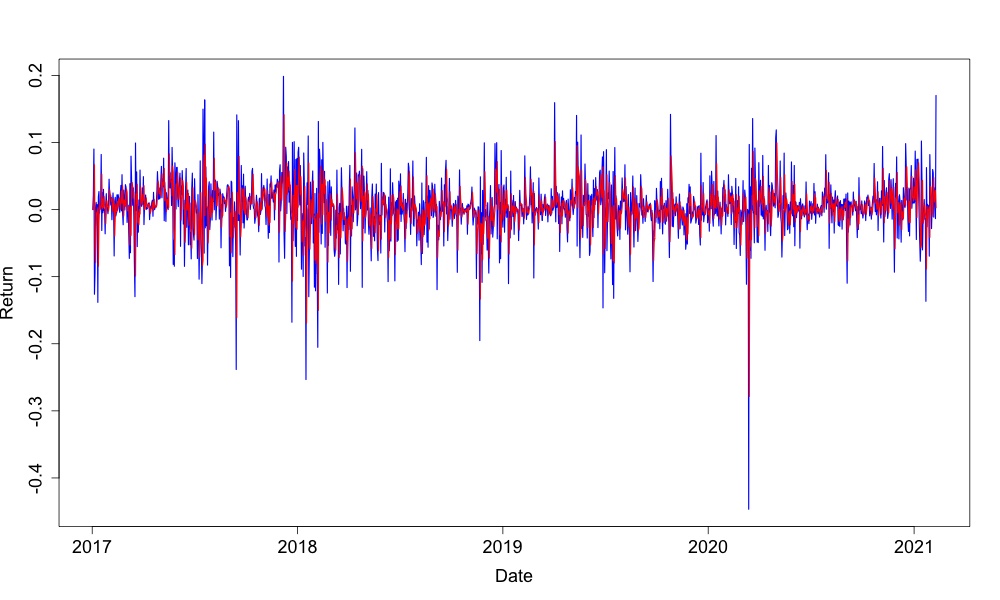

[](http://quantlet.de/)

## [](http://quantlet.de/) **‚KF_modelres'** [](http://quantlet.de/)

```yaml

Name of Quantlet: ‚KF_modelres'
Published in: 'METIS'
Description: 'Use the CRIX data as an example to predict market return by Kalman filter' 
Reference:   https: //gist.github.com/mathew-hall/2ca753c68a594e2c37b1
Data Source: https://thecrix.de
Keywords:    'plot, Kalman Filter, predict, estimation, returns, CRIX, gif'
Author: 'Ruting Rainy WANG' 
```



